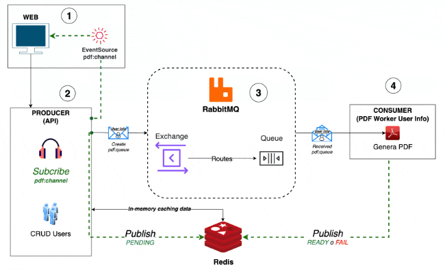

# Fullstack Application with React and Express.js

This README provides instructions on how to run a fullstack application which uses Turbo and Docker Compose. The application consists of a frontend built with React and a backend built with Express.js. The frontend communicates with the backend using RESTful APIs. The backend uses a Redis cache to store data and a RabbitMQ message broker to queue events and communicate with another application that work and consumes messages from a queue and publishes them to a Redis PubSub channel.

## Overview

### Frontend:

- Created a UI package using Vite for rapid setup.
- Implemented UI components and utilized RabbitMQ to queue events.
- Leveraged Redis cache for efficient data storage.
- Enabled pub/sub functionality to inform clients of PDF state changes with Redis for real-time communication through EventSource.

### Backend (Producer):

- Built an Express.js server.
- Integrated with RabbitMQ for message queuing.
- Utilized Redis for caching and efficient data retrieval.

### Worker (Consumer):

- Copy of producer but not exponse through HTTP requests. It handle Rabbitmq subcription to consume messages and integrated Redis Pubsub in it.

## Workflow

<p align="center">
  
</p>

## Prerequisites

Before proceeding, make sure you have the following installed on your machine:

- Node.js v20 (recommended)
- npm >=v8 or NPM >=v9 (recommended)
- Docker
- Docker Compose

__*Important: Allow docker to create volumes in this directory. For Docker Desktop, go to Settings -> Resources -> File Sharing and add the directory where you cloned this repository.*__

## Getting Started


1. Clone the repository:

    ```bash
    cd path/to/your/directory
    git clone https://github.com/MonoReactExpressEDA.git .
    ```

2. Start the containers to run local redis and rabbitmq services (optional if you have your own redis and rabbitmq services running, and you had updated the secrets in the `apps/*/env` directory):

    ```bash
    docker compose --profile local up -d
    ```

3. Read `README.md` inside Add the secrets inside `apps/*/env` directory and change them as per your setup.

4. Install and start monorepo packages:
    
    ```bash
    npm run install
    npm run start:(dev|release)
    ```

5. Access the application:

    Open your web browser and go to `http://localhost:3003` to access the frontend, and `http://localhost:4004` to access the backend producer API.

## WARNING 

- The application is for development purposes only. Do not use it in a production event-streaming are not validating user requests and are not secure. Must implement security measures before deploying to production like ABAC, RBAC, JWT, etc. In this application, we are not using any of these security measures and also stream data is not encrypted and can be intercepted by any other user in the same network.

## Production Deployment

Use `docker-compose.yml` file to deploy the application in production. Make sure to update the .env file for `docker-compose.yml`, you have to rename the `.env.example` file to `.env` and update the values as per your setup, then run the following command to build the images:

```bash
docker compose build
```

Then run the following command to start the services:

```bash
docker compose up -d
```

To stop the services, run the following command:

```bash
docker compose down
```

To view the logs, run the following command:

```bash
docker compose logs -f
```

Check health of the services:

```bash
docker compose ps # to check the status of the services
docker compose top # to check the top processes of the services
docker compose stats # to check the stats of the services
```

## Built With

- [React](https://reactjs.org/) - A JavaScript library for building user interfaces.
- [Express.js](https://expressjs.com/) - A web application framework for Node.js.
- [Redis](https://redis.io/) - An open-source in-memory data structure store.
- [RabbitMQ](https://www.rabbitmq.com/) - A message broker that implements the Advanced Message Queuing Protocol (AMQP).

## License

This project is licensed under the MIT License - see the [LICENSE](LICENSE) file for details.
