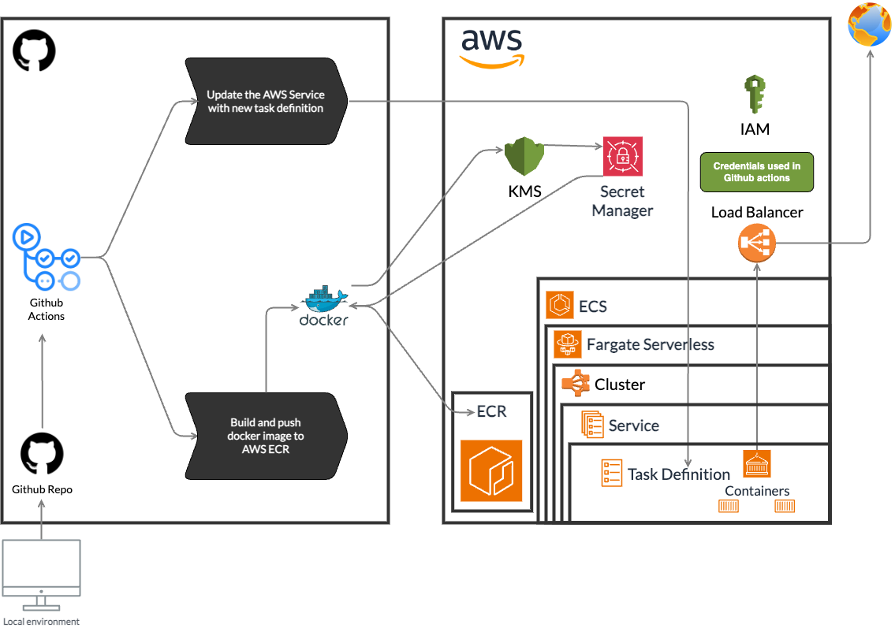

<h1 align="center">Backend with Express.js</h1>

## Requirements

- Node.js v20 (use [nvm](https://github.com/nvm-sh/nvm) to manage multiple Node.js versions.)
- Docker (for RabbitMQ and Redis)
- pnpm v8 (minimum)
- Create an `.env` file that looks like the `.env.example` file.
- Seed default sample database records with `pnpm seed:db` script then CTRL+C to stop the script.

## Installation

```bash
$ nvm install 20
$ nvm use 20 # Manual call to use the right Node.js version
# Automatic call node version by .nvmrc reference: https://github.com/nvm-sh/nvm#bash, so
# when you open a new terminal, the right Node.js version will be used
$ pnpm install
```

## Running the app

```bash
# development
$ pnpm dev

# production mode
$ pnpm build

# run production build (after build)
$ pnpm start

# download secrets from AWS Secrets Manager
$ pnpm env:dev
```

## Usage

```bash
# run tests
$ pnpm test
# run tests with coverage
$ pnpm test:coverage
# run tests with verbose output
$ pnpm test:verbose
# run tests with watch mode
$ pnpm test:watch
# inspect code linting
$ pnpm lint
# fix code linting
$ pnpm lint:fix
# import default sample database records, be sure
# to have a running redis engine running and database empty (with no records)
$ pnpm seed:db
```

# CI/CD

<p align="center"></p>

## Manual ECS Deployment Steps

### Docker Image Build and Push to AWS ECR
1. Login to AWS CLI with `aws ecr get-login-password --region us-east-1 --profile <profile-name> | docker login --username AWS --password-stdin <account-id>.dkr.ecr.us-east-1.amazonaws.com`
2. Build the Docker image with `docker build -t <project>/<env>/<app>:<tag> .`
3. Tag the Docker image with `docker tag <project>/<env>/<app>:<tag> <account-id>.dkr.ecr.us-east-1.amazonaws.com/<project>/<env>/<app>:<tag>`
4. Push the Docker image with `docker push <account-id>.dkr.ecr.us-east-1.amazonaws.com/<project>/<env>/<app>:<tag>`

### ECS Deployment
1. Create a new task definition with the new image version
2. Update the service with the new task definition
3. Wait for the service to be updated
4. Verify the service is running the new image version
